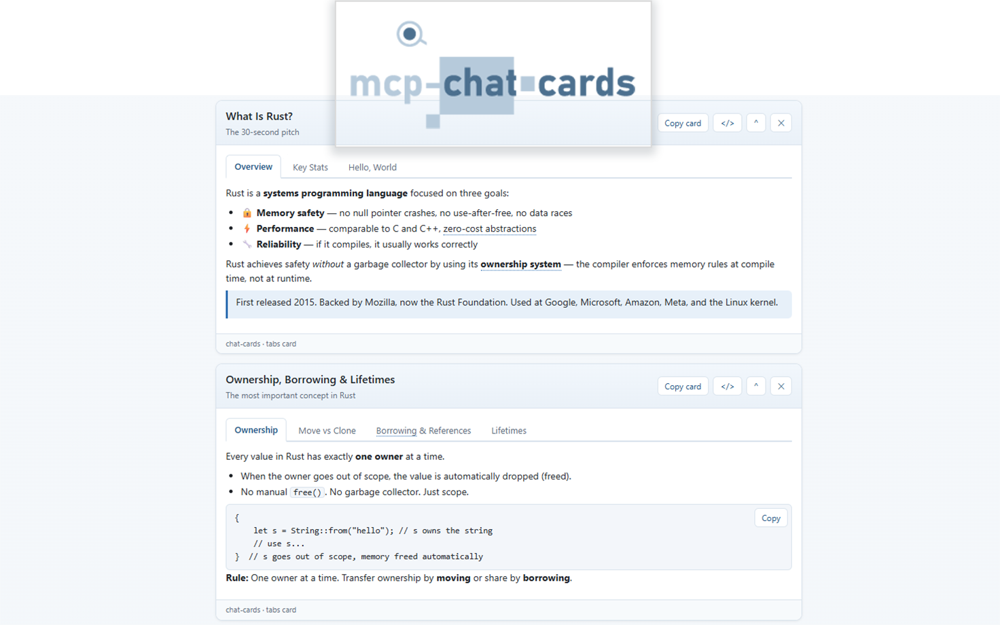

# Chat Cards

Interactive card deck for GitHub Copilot canvas. Instead of walls of text, the
agent explains things visually with a live deck of interactive cards: tab boxes,
tables, SVG charts, forms, collapsible sections, numbered outlines, rendered
markdown documents, and short video clips. Forms are two-way: submitting one
sends the values back to the conversation as the agent's next prompt, so a card
can gather context and steer the session as easily as it presents information.

The extension is a port of an MCP server, which is similar; but renders the cards
inline of the conversation, instead of rendering the HTML in a separate panel.



## What is in the deck

| Action | Card |
| ------ | ---- |
| `create_tab_card` | Tabbed views of one subject (markdown, text, HTML, or code per tab with copy buttons) |
| `create_table_card` | HTML table from explicit rows or loosely delimited raw text (delimiter auto-detected, URL cells become links) |
| `create_chart_card` | SVG bar, line, pie, or donut chart with legend and a collapsible data table |
| `create_form_card` | Form whose submission becomes the next conversation prompt |
| `create_reveal_card` | Collapsible show/hide sections with show-all/hide-all controls |
| `create_list_card` | Nested sequential outline numbered 1., 1.1., 1.1.1. |
| `create_markdown_card` | Render a markdown document as one card: H1 becomes the title, H2 sections fold into reveals |
| `create_video_card` | HTML video player for a short clip (direct file URL, `data:video/*`, or `blob:`) |
| `update_card` | Re-render an existing card in place |
| `remove_card` / `clear_cards` | Take cards off the deck |
| `list_cards` | See the deck (the user may have reordered or removed cards) |
| `get_form_responses` | Read form submissions, newest first |

Every card keeps the signature interactions of the MCP version: a "Copy card" button that
copies the card as a standalone HTML document, a `</>` toggle that shows the card's own
HTML source, a collapse toggle, drag to reorder cards in the deck, tutor terms that show
tooltips after a hover dwell, and model-defined right-click actions that send prompts back
to the conversation (`{{selection}}` in an action prompt is replaced with the user's
selected text). The deck has a light and a dark theme.

## Example action inputs

`create_table_card`:

```json
{
  "title": "JavaScript array methods",
  "headers": ["Method", "Purpose"],
  "rows": [
    ["map", "Transform each item"],
    ["filter", "Keep matching items"],
    ["reduce", "Fold items into one value"]
  ]
}
```

`create_form_card`:

```json
{
  "title": "Study preferences",
  "promptTemplate": "Teach {{topic}} with {{style}} examples.",
  "fields": [
    { "name": "topic", "label": "Topic", "required": true },
    { "name": "style", "type": "select", "options": ["practical", "theoretical"] }
  ]
}
```

When the user submits the form, the filled template is handed to the agent as the next
prompt. If the handoff fails, the card reveals the prompt text with a copy button, and the
agent can always read submissions later with `get_form_responses`.

## Installation

Requires Node.js 18.17 or newer and a GitHub Copilot client that supports
canvas extensions (*such as GitHub Copilot CLI*).

Drop this folder at `~/.copilot/extensions/chat-cards/` for user scope, or
in a repository at `.github/extensions/chat-cards/` for project scope. Then
install dependencies from inside the copied folder:

```bash
# User scope
cd ~/.copilot/extensions/chat-cards

# Or project scope, from the repository root
cd .github/extensions/chat-cards

npm install
```

`npm install` pulls the extension's single dependency (`@github/copilot-sdk`).
Then register the `extension/` folder with your Copilot client as a local
extension, start a session, and ask the agent to open the Chat Cards canvas.

Reload extensions in the GitHub Copilot app, then open the chat-cards canvas in
a conversation.

## How the port maps to the MCP server

| MCP server | Canvas extension |
| ---------- | ---------------- |
| MCP tools (`create_tab_card`, ...) | Canvas actions with the same names and input shapes |
| MCP Apps iframe / embedded HTML resource | Live canvas page served on `127.0.0.1` |
| Form submit posts `ui/message` to the host | Form submit calls `session.send({ prompt })` |
| Card HTML per tool result | Deck state pushed to the page over SSE |
| `src/cards/*` + `src/util/*` (TypeScript) | `cards-core.mjs` (dependency-free port, testable without the SDK) |

Deliberate differences:

- **Stricter HTML sanitizing.** Tab and reveal content can be markdown, text, code, or
  HTML, like the MCP server, but where the server sanitizes HTML with a parser dependency,
  the extension rebuilds it against a strict tag and attribute allowlist: unknown or
  malformed tags render as visible literal text, attributes are re-emitted from scratch,
  and closing tags are balanced. A tab or section with no usable content is rejected with
  an error naming it, instead of rendering an empty panel.
- **No file, archive, or web-fetch actions.** `read_local_file`, `unpack_archive`,
  `fetch_reference`, `mirror_web_form`, and `submit_web_form` stay MCP-only: a Copilot
  agent already reads files and pages natively, so it passes content inline (for example
  `create_markdown_card` takes the markdown itself rather than a path).
- **No multi-part splitting.** MCP hosts cap tool-result sizes, so the server splits large
  documents into parts. The canvas renders directly and needs no parts; the deck instead
  keeps at most 60 cards, dropping the oldest.

## Folder layout

```text
extension/
  extension.mjs           Canvas/session wiring, actions, local HTTP + SSE server
  cards-core.mjs          Card builders and rendering (no SDK import; unit-testable)
  copilot-extension.json  Plugin manifest for the awesome-copilot submission
  package.json            Extension package manifest
  assets/
    canvas.html           The canvas page (theme, card runtime, deck UI)
    preview.png           Screenshot used as the extension logo/preview
```

## Security notes

- The card server binds to `127.0.0.1` on an ephemeral port; every request must carry the
  per-canvas token, and request bodies are size-capped.
- All model- and user-supplied text is HTML-escaped before it reaches card markup, and the
  markdown renderer emits only escaped text nodes.
- The canvas page loads no external scripts, stylesheets, or fonts.
- Prompts sent from the canvas (form submissions and context actions) are length-capped.

## Development

The rendering core has no SDK dependency, so it can be exercised directly:

```bash
node -e "import('./cards-core.mjs').then(m => console.log(m.buildTableCard({ title: 'Demo', rows: [['a', 'b']] }).summary))"
```

To run the extension itself, follow [Installation](#installation) above.
