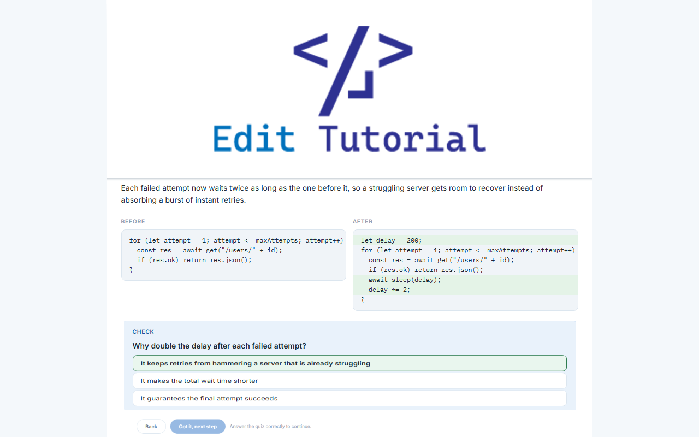

# Edit Tutorial

A canvas extension that turns a set of code changes into an interactive lesson: the
edits the agent made in the current session, or the changes in a commit (the last
commit by default) when the agent made none. The lesson is a step-by-step walkthrough
of each change, comprehension quizzes, and a hands-on exercise the learner finishes in
the canvas in order to understand the updates to the source code.



## Prerequisites

- **Node.js 20.19 or newer** because the Copilot SDK requires `node ^20.19.0 || >=22.12.0`.
- The GitHub Copilot app canvas / UI-extensions experiment enabled.

## Install

Drop this folder at `~/.copilot/extensions/edit-tutorial/` for user scope, or in a repository at
`.github/extensions/edit-tutorial/` for project scope. Then install dependencies from inside the
copied folder:

```sh
# User scope
cd ~/.copilot/extensions/edit-tutorial

# Or project scope, from the repository root
cd .github/extensions/edit-tutorial

npm install
```

Reload extensions in the GitHub Copilot app, then when updating a repository using the Copilot app,
add a line like:

```text
Start an edit tutorial for the update.
```

at the end of the prompt to start the `edit-tutorial` canvas. To learn an existing
change without the agent editing anything, ask on its own:

```text
Start an edit tutorial from the last commit.
```

## What It Does

- **Two sources**: the code edits the agent made in the current session, or the
  changes in a commit when there are no session edits. The most recent commit is the
  default; name any commit to learn that one instead.
- **Lesson history**: each newly titled lesson joins a history of up to 10. When
  more than one exists, arrows under the progress counter let the learner flip
  between lessons, each keeping its own progress. Republishing the active lesson with
  the same title replaces it instead of adding a new one.
- **Walkthrough**: one step per focused edit, each with the file, an explanation, a
  before/after code view with change highlighting, and an optional multiple-choice quiz.
- **Exercise**: finishing the walkthrough unlocks a hands-on task that applies the same
  technique as the session's edits, but as a slight variation (a different function,
  module, or parameter values), so the learner writes the change themselves instead of
  rereading it.
- **Completion**: local regex checks validate the attempt, hints reveal one at a time,
  a reference solution unlocks after repeated failed attempts, and the learner can send
  their code to the agent for a coaching review. Passing the checks, or an approving
  review, completes the lesson.
- **Persistence**: lesson content and learner progress are saved to the session
  workspace, so reopening the canvas resumes where the learner left off. Each save
  also refreshes a read-only HTML snapshot of the rendered lesson, so the tutorial
  survives an app restart as a readable artifact instead of raw state data. All
  Edit Tutorial canvases open in one session share this same lesson state, so a
  second canvas is another view of the same lessons, not a separate copy.

For example, if the agent added retry-with-backoff logic to `fetchUser`, the lesson
walks through that change and then asks the learner to apply the same pattern to
`fetchOrders` with a different attempt cap and starting delay.

## Preserved Artifact

The live canvas is served by the extension process on a loopback port, so it cannot
outlive the app. Two files are written to the session workspace on every save:

| File | Purpose |
| --- | --- |
| `files/edit-tutorial-state.json` | Machine state used to restore the live canvas on reopen |
| `files/edit-tutorial-artifact.html` | Self-contained, read-only rendering of the lesson and progress |

After the app is closed and reopened, the conversation can preserve the HTML artifact
in place of the live canvas: it renders the full walkthrough, quiz results, revealed
hints, and the learner's exercise attempt, with no scripts, no token, and no server
behind it. When the history holds several lessons, the artifact shows the active one
and labels it ("Lesson 2 of 3"). The artifact also embeds the state document, lesson
history included, in a non-executing JSON block, so the lessons can be rebuilt from
the artifact alone if the state file is ever lost.

That rebuild is automatic. A chat resumes the same session, so the canvas restores
from the state file directly. A project reopens into a fresh session whose workspace
holds only what was preserved from the conversation; when the canvas opens and finds
no state file, the extension scans the workspace for a preserved artifact (under its
original name or a copied one) and restores the lessons and progress from its
embedded state block, so the canvas survives wherever the artifact does.

Reopening the canvas is automatic. In a session attached to a repository, the app
brings the workspace files back after a restart but does not reopen the canvas on
its own. Shortly after the session starts, the extension checks a few times whether
a lesson is stored while no canvas has opened, waiting out the app still restoring
files, and then sends the session a reopen request itself, the same message a
stranded learner would type by hand, at most one message per session start. It also hands
the agent the same instruction as context at session start and on each prompt. A
canvas the learner closed on purpose stays closed, and if the canvas still does not
come back, the manual paths below always work.

### If the canvas does not come back after a restart

Three manual paths bring the lesson back immediately in a repository session, best
first:

- **Reopen from the app menu**: click the "+" icon, choose "Extensions", then
  "Edit Tutorial". The canvas opens and restores the stored lessons and progress
  from disk on its own. This is the fastest path and needs no agent turn.
- **Continue by asking**: ask Copilot to "reopen the edit-tutorial canvas". Opening
  the canvas restores everything the same way; nothing is lost by the canvas having
  been closed, and asking does not rebuild or reset the lesson.
- **Read it now**: in the session's Files panel, open `edit-tutorial-artifact.html`
  and choose "Open in browser". That page is the preserved lesson, progress
  included, as a read-only snapshot, and it tells you how to resume.

## Usage

1. Let the agent make a change to your code, then open the Edit Tutorial canvas and
   click "Build my tutorial" (or just ask: "teach me what you changed"). If the agent
   made no edits in the session, the lesson is built from the last commit instead;
   you can also ask for that directly: "teach me the last commit".
2. The agent reviews the session's edits, or the commit's changes, and publishes the
   lesson to the canvas with the `set_tutorial` action.
3. Work through the steps, answer the quizzes, and finish the exercise in the canvas
   editor.

## Canvas Actions

| Action | Purpose |
| --- | --- |
| `set_tutorial` | Publish a lesson (title, summary, source, steps, exercise); a new title adds to the lesson history, the active title replaces |
| `get_progress` | Read the learner's step progress and current exercise attempt |
| `approve_exercise` | Mark the exercise complete after a successful review |
| `reset_progress` | Restart the current lesson without changing its content |

### Example `set_tutorial` Payload

Quizzes are optional per step. Each `solutionChecks` entry is a JavaScript regular
expression the learner's attempt must match; its `hint` is shown when the check fails.

<details>

<summary>Show Details</summary>

```json
{
  "title": "Retry with exponential",
  "summary": "The API client now retries transient failures with exponential.",
  "source": "Commit a1b2c3d: retry transient API failures",
  "steps": [
    {
      "file": "src/api/client.js",
      "heading": "Wrap the request in a retry loop",
      "explanation": "The single request call becomes a bounded loop.",
      "before": "const res = await get(\"/users/\" + id);",
      "after": "for (let attempt = 1; attempt <= maxAttempts; attempt++) { ... }",
      "quiz": {
        "question": "Why bound the loop?",
        "options": ["To avoid retrying forever", "To speed up requests"],
        "answerIndex": 0,
        "why": "A bounded loop guarantees the call eventually settles."
      }
    }
  ],
  "exercise": {
    "heading": "Your turn: retry the orders endpoint",
    "brief": "Apply the same pattern to fetchOrders, capped at 5 attempts.",
    "file": "src/api/orders.js",
    "starterCode": "async function fetchOrders(customerId) { ... }",
    "hints": ["Start from the loop shape used in fetchUser."],
    "solutionChecks": [
      { "pattern": "maxAttempts\\s*=\\s*5", "hint": "Cap the attempts at 5" }
    ],
    "solution": "async function fetchOrders(customerId) { ... }"
  }
}
```

</details>

## Distribution

This extension is shipped through the `edit-tutorial` plugin:

```bash
copilot plugin install edit-tutorial@awesome-copilot
```
