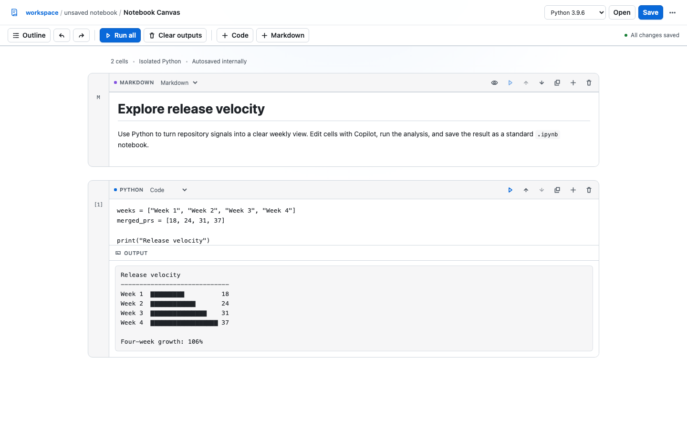

# Jupyter Notebooks

Create, edit, run, save, and checkpoint Jupyter notebooks in an interactive GitHub Copilot canvas.



## What it does

- Opens existing `.ipynb` files from the current workspace.
- Creates code, Markdown, and raw cells with reorder, duplicate, undo, and redo controls.
- Runs Python cells through a fresh isolated process with bounded resources and captured rich output.
- Saves, renames, and duplicates notebooks as standard `.ipynb` files.
- Creates persistent checkpoints that can be restored from the canvas.

## Requirements

- Python 3 available as `python3` or `python`.
- The `@github/copilot-sdk` package installed with the extension.

## Install

Ask Copilot to install the committed extension:

```text
Install this extension: https://github.com/github/awesome-copilot/tree/main/extensions/jupyter-notebooks
```

Reload extensions, then ask Copilot to open the `jupyter-notebooks` canvas.

## Agent actions

The canvas provides actions for notebook lifecycle, workspace files, cell editing, execution, runtime selection, and checkpoints. Use `get_notebook` to inspect the current state before editing a cell.

## Security and local data

Notebook execution uses Python isolated mode in a fresh temporary directory. The runner applies CPU, file-size, process, and memory limits where the platform supports them, caps captured output, and stops execution after 30 seconds.

The local canvas server binds to `127.0.0.1`, protects requests with a per-instance capability token, validates action origins, and sends a restrictive content security policy. Notebook state and checkpoints stay in the active Copilot workspace.
